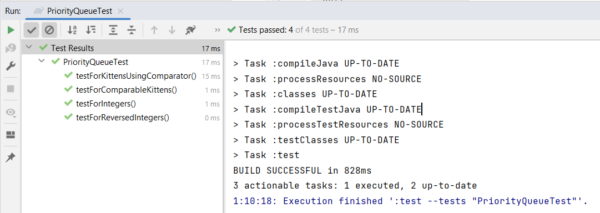

# Priority Queue

Автор: Диана Харлап

## Проверка проекта

Для проверки проекта были реализованы юнит-тесты



## Условия задания
Интерфейс должен иметь следующие методы:
- add
- peek
- poll

Очередь должна поддерживать хранение любых элементов, реализующих Comparable, поэтому используем Java Generics
Для сравнения элементов использовать Comparable.

Реализация должна использовать по умолчанию структуру данных "Минимальная двоичная куча", которую разбирали на занятии.
То есть в вершине лежит минимальный элемент.

Элементы требуется хранить в обычном Java массиве.
Массив должен динамически расширяться при добавлении новых элементов
Начальный размер массива - 8.

Должны быть реализованы процедуры siftUp и siftDown.
Рекурсию использовать нельзя - итерацию осуществляем по индексам.	

Добавить возможность указать в конструкторе Comparator и использовать его вместо Comparable:

- в очереди можно хранить элементы, которые не реализуют Comparable                                                      
- если был предоставлен Comparator, то использовать его
- если не был предоставлен Comparator, сравнивать по Comparable
- если нет ни Comparator, ни реализован Comparable, то должна вывестись ошибка

В таком случае, следующий код должен вывести 20:

```java
PriorityQueue<Integer> q = new PriorityQueue<>(Comparator.reverseOrder());
q.add(10);
q.add(20);
System.out.println(q.peek());
```
